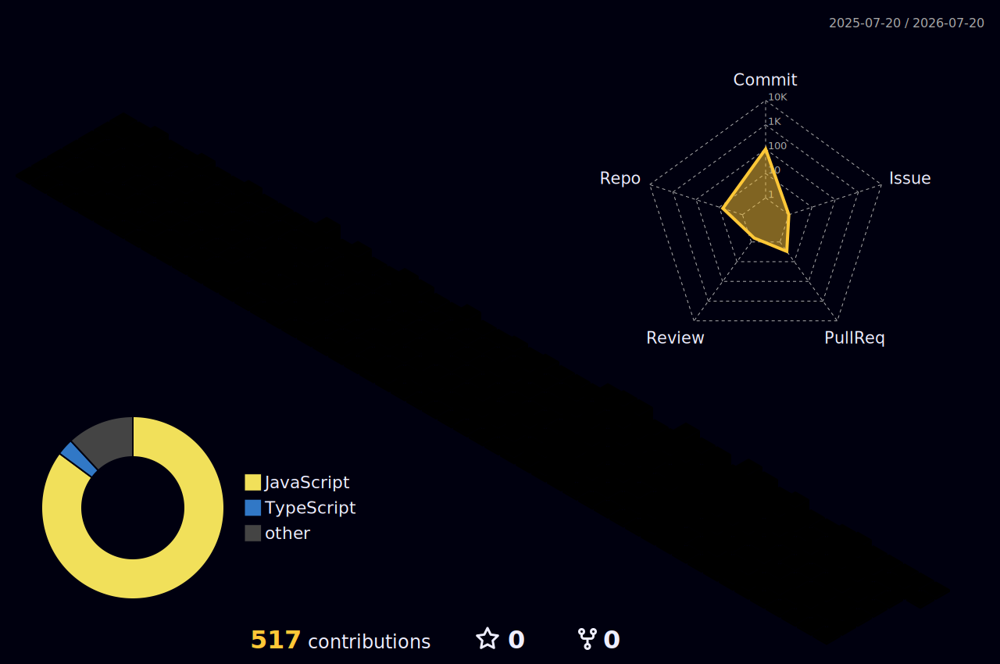

<div align="center">


<br/>

<a href="https://github.com/marzi3">
  
</a>

<br/>

<a href="https://www.linkedin.com/in/maryamwimaleswaran/"></a>
<a href="mailto:maryamwimaleswaran@gmail.com"></a>
<a href="#"></a>

</div>

<br/>

<div align="center">
  
</div>

<br/>

<table align="center" border="0" cellpadding="0" cellspacing="0" width="100%">
<tr>
<td width="65%" valign="top">

  <h2 align="left">🌸 About Me (ﾉ◕ヮ◕)ﾉ*:･ﾟ✧</h2>
  
  <blockquote>
    <i>Building secure, scalable systems and exploring how AI solves real-world problems.</i> 🌷
  </blockquote>

```yaml
name: "Maryam"
role: "Software Engineering Undergrad @ SLIIT ✨"
focus: ["Full-Stack Dev", "AI/ML", "Backend Engineering"]
stack: ["MERN", "Spring Boot", "MySQL", "MongoDB"]
exploring: ["Deep Learning", "Explainable AI (XAI)"]
```

- 🎀 Specializing in **Software Engineering** at **SLIIT**
- 🍰 Experienced in building modular architectures with **MERN** & **Spring Boot**
- 🍓 Hands-on with **CNNs, EfficientNetB0,** and **Grad-CAM**
- ☁️ Passionate about secure authentication (JWT, BCrypt, RBAC)
- 💌 Reach me at: **maryamwimaleswaran@gmail.com**

</td>
<td width="35%" align="center" valign="top">

  <br/><br/>
  
  <br/><br/>
  

</td>
</tr>
</table>

<br/>

<div align="center">
  
</div>

<br/>

<div align="center">
  <h2>💖 Tech Stack</h2>
  <br/>
  
  
  
  <br/><br/>
  
  <p>
    
    
    
    
    
  </p>
</div>

<br/>

<div align="center">
  
</div>

<br/>

<div align="center">
  <h2>🌟 Featured Projects</h2>
</div>

<table align="center" width="100%">
<tr>
  <td width="50%" valign="top">
    <div align="center">
      
    </div>
    <br/>
    Forward-chaining inference engine with multi-factor scoring, ranking 500+ internships in real-time. Integrated <b>Explainable AI (XAI)</b> logs detailing each match's weightings. ✨
    <br/><br/>
    <div align="center">
      <code>MERN</code> <code>Next.js</code> <code>Passport.js</code> <code>Socket.io</code>
    </div>
  </td>
  
  <td width="50%" valign="top">
    <div align="center">
      
    </div>
    <br/>
    A full-stack grocery ordering platform built with a 5-person team, featuring JWT + BCrypt authentication and modular MVC e-commerce components. 🛒💕
    <br/><br/>
    <div align="center">
      <code>Java</code> <code>Spring Boot</code> <code>MySQL</code> <code>React.js</code>
    </div>
  </td>
</tr>

<tr>
  <td width="50%" valign="top">
    <div align="center">
      
    </div>
    <br/>
    End-to-end deep learning classifier for plant diseases. Benchmarked architectures and selected <b>EfficientNetB0</b> to achieve 86% test accuracy, using <b>Grad-CAM</b>. 🍅🌱
    <br/><br/>
    <div align="center">
      <code>Python</code> <code>CNN</code> <code>EfficientNetB0</code> <code>Grad-CAM</code>
    </div>
  </td>

  <td width="50%" valign="top">
    <div align="center">
      
    </div>
    <br/>
    Role-based event management platform with real-time seat tracking, RBAC, and session-based authentication, built on modular OOP and MVC principles. 🎟️🎀
    <br/><br/>
    <div align="center">
      <code>Java</code> <code>Spring Boot</code> <code>MVC</code> <code>RBAC</code>
    </div>
  </td>
</tr>

<tr>
  <td width="50%" valign="top">
    <div align="center">
      
    </div>
    <br/>
    Assistive IoT device with ultrasonic obstacle detection, buzzer alerts, GPS tracking, and an emergency SOS button, built on a fully integrated ESP32 hardware-software stack. 🦯💫
    <br/><br/>
    <div align="center">
      <code>ESP32</code> <code>Embedded C</code> <code>Arduino IDE</code>
    </div>
  </td>

  <td width="50%" valign="top" align="center">
    <br/>
    
    <br/><br/>
    <a href="#"><b>🌐 View More on My Portfolio</b></a>
  </td>
</tr>
</table>

<br/>

<div align="center">
  
</div>

<br/>

<div align="center">
  <h2>📊 GitHub Analytics (❁´◡`❁)</h2>
  <br/>
  
  
  
  
  <br/>
  
  
  
  <br/><br/>
  
  
</div>

<br/>

<div align="center">
  
</div>

<br/>

<div align="center">
  <h2>🌌 3D Contribution Calendar</h2>
  <br/>
  
  
  
  <br/><br/>
  
  <sub>Updated daily via GitHub Actions • <a href="https://github.com/yoshi389111/github-profile-3d-contrib">yoshi389111/github-profile-3d-contrib</a></sub>
</div>

<br/>

<div align="center">
  <h3>( ˘ ³˘)♥</h3>
  <br/>
  <sub>Thanks for stopping by! Let's collaborate on something great. 💕</sub>
</div>


